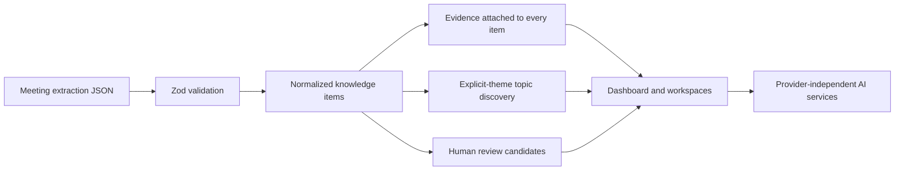

# Second Brain for Work

An evidence-first meeting knowledge application. The first useful release turns the supplied `meeting-extract.json` into a browsable command center for atomic knowledge, persistent topics, review candidates, briefings, and conservative growth evidence.

## Run locally

```bash
npm install
npm run verify:ingestion
npm run dev
```

Open `http://localhost:3000/dashboard`.

Tests use synthetic fixtures in `backend/tests/fixtures/`, and `scripts/seed_seaweedfs.py` uploads whatever `data/*.json` exists.

PostgreSQL with pgvector is provided for the next persistence slice: `docker compose up -d`. The current slice works without Docker, an API key, or an external AI provider.

## Backend (meeting data via SeaweedFS)

The FastAPI backend in `backend/` loads meeting extraction files from a self-hosted [SeaweedFS](https://github.com/seaweedfs/seaweedfs) S3-compatible bucket instead of the local JSON file.

```bash
docker compose up -d seaweedfs
cd backend
python -m venv .venv && .venv\Scripts\activate  # or source .venv/bin/activate
pip install -r requirements.txt
```

`backend/.env` is committed with working defaults that match the `seaweedfs` compose service (`python-dotenv` loads it automatically on startup, so these survive process restarts). Override any of them with real shell env vars if needed:

| Variable | Purpose | Example |
| --- | --- | --- |
| `S3_BUCKET` | Bucket holding meeting extract JSON files (required) | `second-brain` |
| `S3_PREFIX` | Key prefix to list under (optional) | `meetings/` |
| `S3_ENDPOINT_URL` | SeaweedFS S3 gateway URL (required) | `http://localhost:8334` |
| `S3_REGION` | Arbitrary region (SeaweedFS doesn't validate it) | `us-east-1` |
| `AWS_ACCESS_KEY_ID` / `AWS_SECRET_ACCESS_KEY` | Must match an identity in the `seaweedfs` compose service's config | `second_brain` / `second_brain_dev_secret` |
| `INGEST_ON_STARTUP` | Ingest all S3 extraction files into Postgres every time the backend starts (set `false` to skip, e.g. for tests/CI without S3 configured) | `true` |

Bootstrap the bucket with the sample extraction files (also reads `backend/.env` if run from `backend/`, or pass the same env vars manually):

```bash
python scripts/seed_seaweedfs.py
```

### When extracts are processed

Uploading a file to the bucket does not, by itself, make it show up in the app — it needs to be
ingested (`backend/app/ingest.py`) into Postgres first. Ingestion now runs automatically every time
the backend starts (in the FastAPI `lifespan` hook in `backend/app/main.py`, gated by
`INGEST_ON_STARTUP`), so restarting the server is enough to pick up new or changed extraction files.
If SeaweedFS or Postgres is unreachable at startup, the failure is logged and the API still starts,
serving whatever was already ingested. To re-ingest without restarting the server (or to disable the
startup hook in `INGEST_ON_STARTUP=false` environments), run the same logic manually:

```bash
python scripts/ingest_to_postgres.py
```

Both paths call the same `ingest.ingest_and_commit()`, which lists every object under `S3_PREFIX` in
the bucket, parses each as a meeting extraction, embeds each `KnowledgeItem` description, and upserts
meetings/items/topics/review candidates into Postgres. There is still no file watcher or webhook —
ingestion only happens on backend startup or when the script is run explicitly. Re-running it is safe
and idempotent: rows are keyed by the normalized `meeting_id:candidate_id` identity and upserted
(`ON CONFLICT DO UPDATE`), and a human's review decision (`status`) is never clobbered by a re-ingest.
A knowledge item's `topic_id` is likewise only assigned the first time that identity is seen, so
re-ingesting an unchanged file never resurrects a topic the user manually reassigned or deleted the
item from. Different files never dedupe against each other purely by content: two candidates only
collapse into one row if they resolve to the same `meeting_id:candidate_id`; otherwise similar or
duplicate-sounding items across meetings stay as separate rows, linked only loosely after the fact via
the embedding-based "similar items" and topic-merge-suggestion features described below.

#### Ingesting the same meeting from multiple LLM extracts

Two different LLMs (or two runs) sometimes each produce their own extraction file for the *same*
meeting. Name the files `<meeting-key>--<variant>.json` (e.g. `standup-2026-09-08--gpt4.json` and
`standup-2026-09-08--claude.json`) so `ingest._derive_meeting_identity` recognizes them as one
canonical meeting: both files upsert into a single `MeetingRow` keyed by `<meeting-key>`, while
`<variant>` namespaces each file's item/review-candidate ids (`meeting_id:variant:candidate_id`) so
the two LLMs' independently-numbered candidates never collide. Files without `--` behave exactly as
before (the whole filename stem is the meeting key). Files that don't share a `<meeting-key>` are
still treated as unrelated meetings, even if their content is similar.

Within one canonical meeting, a new idea/decision/action/question is compared by embedding cosine
distance against that meeting's existing items before insert; a close match (same
`DUPLICATE_MATCH_THRESHOLD` used by the review-accept dedup in `app/data.py`) reinforces the
existing item's confidence to `HIGH` instead of inserting a duplicate row. This dedup is scoped to
the one meeting, not global — items that merely *sound* similar across different meetings are left
alone, same as the paragraph above.

#### Ingesting a multi-meeting bundle

A file can also be a **bundle** covering several meetings at once (e.g. a register export), instead
of one meeting's fields directly at the top level. The extraction tool isn't stable about the exact
bundle shape (it has named the array of per-meeting entries `extractions` in one file and `meetings`
in another, and doesn't always repeat `schema_version` on each entry), so `ingest.parse_meetings_from_s3`
(used instead of `parse_meeting_from_s3` for this shape) detects a bundle structurally instead of by
a fixed key name: if the whole file doesn't parse as one meeting, it looks for the top-level list
whose entries each have their own `"meeting"` key (`ingest._find_bundle_entries`) — which correctly
skips look-alike summary lists (e.g. a `coverage` array of flat `meeting_id`/`date`/count rows) that
aren't per-meeting extractions. Each entry found this way becomes its own `Meeting`, keyed
`<meeting-key>-<n>` (`<n>` is the entry's 1-based position in the array) so the meetings from one
bundle file never collide with each other. Everything downstream (topic matching, dedup,
`--<variant>` namespacing) works exactly as it does for a single-meeting file.

A file can also be single-meeting-*shaped* (no nested `extractions`/`meetings` array) while actually
covering several real meetings flattened into one — a register export whose candidates each embed a
`source meeting MTG-... (date, ...)` annotation inside `evidence.context` instead of being nested
per meeting. `ingest._split_by_embedded_source_meeting` detects this (only when at least one
candidate carries the annotation — a genuine single meeting's evidence never does) and regroups
candidates by their tagged source meeting into one `Meeting` per date, again keyed
`<meeting-key>-<n>`. `review_candidates` have no `evidence.context` to tag them with, so they can't
be attributed to a specific source meeting; they're kept together in one extra
`<meeting-key>-review` record instead of being dropped. If only some candidates carry the
annotation, ingestion fails loudly rather than guessing which meeting the untagged ones belong to.
A trailing "(N meetings)" annotation on the register's own title (e.g. "DC-MS 1:1 Meeting Register
(12 meetings)") is stripped for every derived meeting, since it describes the whole file rather than
any individual split-out meeting.

## Semantic embeddings (sentence-transformers)

Ingestion (`backend/app/ingest.py`) embeds every `KnowledgeItem` description with
`sentence-transformers` (`all-MiniLM-L6-v2`, 384 dimensions) and stores the vector in the
`knowledge_items.embedding` pgvector column. This powers two features that plain-text/explicit
links can't cover on their own:

- **"Similar items"** (`data.semantic_similar_items`, surfaced on `/items/[id]`) — nearest
  neighbors by cosine distance, a supplement to (not a replacement for) the evidence-grounded
  `related_ids` links.
- **Duplicate detection on Accept** (`data._find_similar_item`, used by the `/review` page) — when
  a review candidate is accepted, its description is embedded and compared against existing
  items; a close match is merged into instead of creating a duplicate `KnowledgeItem`.

If the model weights can't be downloaded (no network, or a blocked host such as a corporate TLS
proxy), `backend/app/embeddings.py` catches the failure and falls back to a deterministic offline
`HashingVectorizer` so the pgvector pipeline still runs end-to-end. It self-upgrades to the real
model automatically once the download succeeds - no code change or re-ingestion required.

### Hugging Face download troubleshooting

`sentence-transformers` fetches `all-MiniLM-L6-v2` from the Hugging Face Hub on first use and caches
it under `~/.cache/huggingface`. On a network with a TLS-inspecting proxy (e.g. Zscaler):

- `pip install pip-system-certs` fixes `CERTIFICATE_VERIFY_FAILED` errors by making Python trust the
  OS certificate store instead of only its bundled CA list.
- `pip install "huggingface_hub[hf_xet]"` enables the faster `hf_xet` transfer backend, which can
  succeed where the default HTTP downloader stalls or is blocked; set `HF_HUB_DISABLE_XET=1` to force
  the legacy backend if `hf_xet` itself is the one being blocked.
- Some proxies block only the CDN subdomain that serves the actual model weights (`huggingface.co`
  itself and small config/JSON files still resolve fine). If the download still fails after the above,
  it's likely a network policy block rather than a client-side bug - the offline `HashingVectorizer`
  fallback above keeps everything else working until it's unblocked.

## Architecture



The domain boundary is in `src/lib/domain.ts`; defensive loading and normalization are in `src/lib/data.ts`. UI components do not invent conclusions: topic and growth pages state when evidence is insufficient. The eventual persistence layer should map the same concepts to Meeting, Person, KnowledgeItem, Evidence, Topic, TopicMembership, Relationship, Outcome, StatusHistory, ReviewCandidate, Competency, and GrowthSignal tables.

## Routes

`/dashboard`, `/meetings`, `/meetings/[id]`, `/items`, `/actions`, `/questions`, `/decisions`, `/topics`, `/topics/[id]`, `/review`, `/briefing`, `/ask`, `/growth`, `/growth/impact`, and `/growth/career`.

## Source mapping

Ideas, decisions, actions, and questions become a common `KnowledgeItem`. Evidence retains speaker, quote, context, and nullable timestamp. `related_candidate_ids` are preserved as source relationships; the UI does not assign a stronger semantic edge than the source proves. Review candidates remain pending and are never automatically promoted. Qualitative confidence remains High, Medium, or Low.

## Testing and limitations

`npm run verify:ingestion` checks required counts, key relationships, evidence preservation, A-009's normalized date, A-010's unresolved date, and review-candidate separation. `npm run build` validates the application.

This is a working local vertical slice, not yet the complete PostgreSQL-backed multi-meeting system. Persistence, upload APIs, editable review decisions, embeddings, relationship suggestions, outcomes, and provider-backed synthesis are the next implementation step. No business impact or professional pattern is fabricated when absent from stored evidence.
