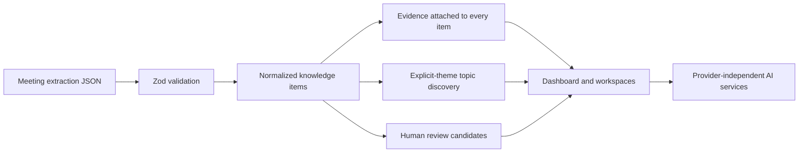

# Second Brain for Work

An evidence-first meeting knowledge application. The first useful release turns the supplied `meeting-extract.json` into a browsable command center for atomic knowledge, persistent topics, review candidates, briefings, and conservative growth evidence.

## Run locally

```bash
npm install
npm run verify:ingestion
npm run dev
```

Open `http://localhost:3000/dashboard`.

The source JSON is preserved in `data/meeting-extract.json`. The provided file has a missing opening `{`; the importer repairs only that wrapper defect before Zod validation. Normalized identity is `meeting_id + candidate_id`.

PostgreSQL with pgvector is provided for the next persistence slice: `docker compose up -d`. The current slice works without Docker, an API key, or an external AI provider.

## Architecture



The domain boundary is in `src/lib/domain.ts`; defensive loading and normalization are in `src/lib/data.ts`. UI components do not invent conclusions: topic and growth pages state when evidence is insufficient. The eventual persistence layer should map the same concepts to Meeting, Person, KnowledgeItem, Evidence, Topic, TopicMembership, Relationship, Outcome, StatusHistory, ReviewCandidate, Competency, and GrowthSignal tables.

## Routes

`/dashboard`, `/meetings`, `/meetings/[id]`, `/items`, `/actions`, `/questions`, `/decisions`, `/topics`, `/topics/[id]`, `/review`, `/briefing`, `/ask`, `/growth`, `/growth/impact`, and `/growth/career`.

## Source mapping

Ideas, decisions, actions, and questions become a common `KnowledgeItem`. Evidence retains speaker, quote, context, and nullable timestamp. `related_candidate_ids` are preserved as source relationships; the UI does not assign a stronger semantic edge than the source proves. Review candidates remain pending and are never automatically promoted. Qualitative confidence remains High, Medium, or Low.

## Testing and limitations

`npm run verify:ingestion` checks required counts, key relationships, evidence preservation, A-009's normalized date, A-010's unresolved date, and review-candidate separation. `npm run build` validates the application.

This is a working local vertical slice, not yet the complete PostgreSQL-backed multi-meeting system. Persistence, upload APIs, editable review decisions, embeddings, relationship suggestions, outcomes, and provider-backed synthesis are the next implementation step. No business impact or professional pattern is fabricated when absent from stored evidence.
