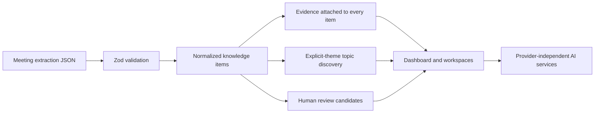

# Second Brain for Work

An evidence-first meeting knowledge application. The first useful release turns the supplied `meeting-extract.json` into a browsable command center for atomic knowledge, persistent topics, review candidates, briefings, and conservative growth evidence.

## Run locally

```bash
npm install
npm run verify:ingestion
npm run dev
```

Open `http://localhost:3000/dashboard`.

The source JSON is preserved in `data/meeting-extract.json`. The provided file has a missing opening `{`; the importer repairs only that wrapper defect before Zod validation. Normalized identity is `meeting_id + candidate_id`.

PostgreSQL with pgvector is provided for the next persistence slice: `docker compose up -d`. The current slice works without Docker, an API key, or an external AI provider.

## Backend (meeting data via SeaweedFS)

The FastAPI backend in `backend/` loads meeting extraction files from a self-hosted [SeaweedFS](https://github.com/seaweedfs/seaweedfs) S3-compatible bucket instead of the local JSON file.

```bash
docker compose up -d seaweedfs
cd backend
python -m venv .venv && .venv\Scripts\activate  # or source .venv/bin/activate
pip install -r requirements.txt
```

`backend/.env` is committed with working defaults that match the `seaweedfs` compose service (`python-dotenv` loads it automatically on startup, so these survive process restarts). Override any of them with real shell env vars if needed:

| Variable | Purpose | Example |
| --- | --- | --- |
| `S3_BUCKET` | Bucket holding meeting extract JSON files (required) | `second-brain` |
| `S3_PREFIX` | Key prefix to list under (optional) | `meetings/` |
| `S3_ENDPOINT_URL` | SeaweedFS S3 gateway URL (required) | `http://localhost:8334` |
| `S3_REGION` | Arbitrary region (SeaweedFS doesn't validate it) | `us-east-1` |
| `AWS_ACCESS_KEY_ID` / `AWS_SECRET_ACCESS_KEY` | Must match an identity in the `seaweedfs` compose service's config | `second_brain` / `second_brain_dev_secret` |

Bootstrap the bucket with the sample extraction files (also reads `backend/.env` if run from `backend/`, or pass the same env vars manually):

```bash
python scripts/seed_seaweedfs.py
```

## Semantic embeddings (sentence-transformers)

Ingestion (`backend/app/ingest.py`) embeds every `KnowledgeItem` description with
`sentence-transformers` (`all-MiniLM-L6-v2`, 384 dimensions) and stores the vector in the
`knowledge_items.embedding` pgvector column. This powers two features that plain-text/explicit
links can't cover on their own:

- **"Similar items"** (`data.semantic_similar_items`, surfaced on `/items/[id]`) — nearest
  neighbors by cosine distance, a supplement to (not a replacement for) the evidence-grounded
  `related_ids` links.
- **Duplicate detection on Accept** (`data._find_similar_item`, used by the `/review` page) — when
  a review candidate is accepted, its description is embedded and compared against existing
  items; a close match is merged into instead of creating a duplicate `KnowledgeItem`.

If the model weights can't be downloaded (no network, or a blocked host such as a corporate TLS
proxy), `backend/app/embeddings.py` catches the failure and falls back to a deterministic offline
`HashingVectorizer` so the pgvector pipeline still runs end-to-end. It self-upgrades to the real
model automatically once the download succeeds - no code change or re-ingestion required.

## Architecture



The domain boundary is in `src/lib/domain.ts`; defensive loading and normalization are in `src/lib/data.ts`. UI components do not invent conclusions: topic and growth pages state when evidence is insufficient. The eventual persistence layer should map the same concepts to Meeting, Person, KnowledgeItem, Evidence, Topic, TopicMembership, Relationship, Outcome, StatusHistory, ReviewCandidate, Competency, and GrowthSignal tables.

## Routes

`/dashboard`, `/meetings`, `/meetings/[id]`, `/items`, `/actions`, `/questions`, `/decisions`, `/topics`, `/topics/[id]`, `/review`, `/briefing`, `/ask`, `/growth`, `/growth/impact`, and `/growth/career`.

## Source mapping

Ideas, decisions, actions, and questions become a common `KnowledgeItem`. Evidence retains speaker, quote, context, and nullable timestamp. `related_candidate_ids` are preserved as source relationships; the UI does not assign a stronger semantic edge than the source proves. Review candidates remain pending and are never automatically promoted. Qualitative confidence remains High, Medium, or Low.

## Testing and limitations

`npm run verify:ingestion` checks required counts, key relationships, evidence preservation, A-009's normalized date, A-010's unresolved date, and review-candidate separation. `npm run build` validates the application.

This is a working local vertical slice, not yet the complete PostgreSQL-backed multi-meeting system. Persistence, upload APIs, editable review decisions, embeddings, relationship suggestions, outcomes, and provider-backed synthesis are the next implementation step. No business impact or professional pattern is fabricated when absent from stored evidence.
