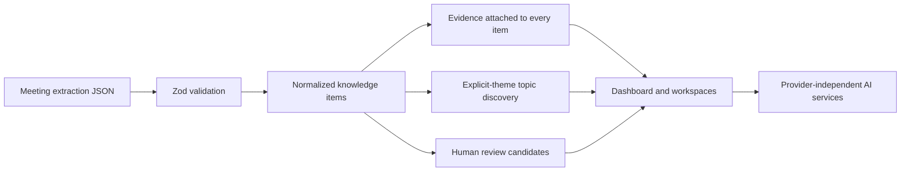

# Second Brain for Work

An evidence-first meeting knowledge application. The first useful release turns the supplied `meeting-extract.json` into a browsable command center for atomic knowledge, persistent topics, review candidates, briefings, and conservative growth evidence.

## Run locally

```bash
npm install
npm run verify:ingestion
npm run dev
```

Open `http://localhost:3000/dashboard`.

Tests use synthetic fixtures in `backend/tests/fixtures/`, and `scripts/seed_seaweedfs.py` uploads whatever `data/*.json` exists.

PostgreSQL with pgvector is provided for the next persistence slice: `docker compose up -d`. The current slice works without Docker, an API key, or an external AI provider.

## Backend (meeting data via SeaweedFS)

The FastAPI backend in `backend/` loads meeting extraction files from a self-hosted [SeaweedFS](https://github.com/seaweedfs/seaweedfs) S3-compatible bucket instead of the local JSON file.

```bash
docker compose up -d seaweedfs
cd backend
python -m venv .venv && .venv\Scripts\activate  # or source .venv/bin/activate
pip install -r requirements.txt
```

`backend/.env` is committed with working defaults that match the `seaweedfs` compose service (`python-dotenv` loads it automatically on startup, so these survive process restarts). Override any of them with real shell env vars if needed:

| Variable | Purpose | Example |
| --- | --- | --- |
| `S3_BUCKET` | Bucket holding meeting extract JSON files (required) | `second-brain` |
| `S3_PREFIX` | Key prefix to list under (optional) | `meetings/` |
| `S3_IMAGES_PREFIX` | Key prefix for images attached to topics (optional, defaults to `images/`) | `images/` |
| `S3_ENDPOINT_URL` | SeaweedFS S3 gateway URL (required) | `http://localhost:8334` |
| `S3_REGION` | Arbitrary region (SeaweedFS doesn't validate it) | `us-east-1` |
| `AWS_ACCESS_KEY_ID` / `AWS_SECRET_ACCESS_KEY` | Must match an identity in the `seaweedfs` compose service's config | `second_brain` / `second_brain_dev_secret` |
| `INGEST_ON_STARTUP` | Ingest all S3 extraction files into Postgres every time the backend starts (set `false` to skip, e.g. for tests/CI without S3 configured) | `true` |

Bootstrap the bucket with the sample extraction files (also reads `backend/.env` if run from `backend/`, or pass the same env vars manually):

```bash
python scripts/seed_seaweedfs.py
```

### Topic images

Images attached to a topic are stored in the same bucket as the extracts, under `S3_IMAGES_PREFIX`
(`images/topics/<topicId>/<imageId>.<ext>`), so ingestion (which only reads `S3_PREFIX`) never sees
them and the `seaweedfs-backup` service backs them up with everything else. Postgres keeps only the
metadata (`topic_images` table). The bucket stays private: the browser loads images through the
Next.js route `/api/topics/<id>/images/<imageId>`, which proxies the FastAPI endpoint. Uploads accept
PNG, JPEG, GIF and WebP up to 5 MB (checked on the file's bytes, not its name), and deleting an image
or a topic removes the S3 objects too.

### When extracts are processed

Uploading a file to the bucket does not, by itself, make it show up in the app — it needs to be
ingested (`backend/app/ingest.py`) into Postgres first. Ingestion now runs automatically every time
the backend starts (in the FastAPI `lifespan` hook in `backend/app/main.py`, gated by
`INGEST_ON_STARTUP`), so restarting the server is enough to pick up new or changed extraction files.
If SeaweedFS or Postgres is unreachable at startup, the failure is logged and the API still starts,
serving whatever was already ingested. To re-ingest without restarting the server (or to disable the
startup hook in `INGEST_ON_STARTUP=false` environments), click **Ingest from SeaweedFS** at the top of
`/meetings` (`IngestMeetingsButton` → `ingestMeetingsAction` → `POST /api/ingest`), or run the same
logic from the command line:

```bash
python scripts/ingest_to_postgres.py
```

All three paths call the same `ingest.ingest_and_commit()`, which lists every object under `S3_PREFIX` in
the bucket, parses each as a meeting extraction, embeds each `KnowledgeItem` description, and upserts
meetings/items/topics/review candidates into Postgres. It returns an `ingest.IngestSummary` that
splits the distinct meetings it saw into **new** (not in Postgres before the run), **updated** (already
there, but at least one meeting/item/review-candidate row was inserted or changed) and **unchanged**.
`POST /api/ingest` returns `{"meetings": <total>, "new": n, "updated": n, "unchanged": n}`; it answers
`409` while another run (including the startup one) is still in progress, `503` when SeaweedFS can't
be reached, and `422` when an extract is malformed. The button shows the result inline (e.g.
"2 new meetings, 1 updated · 64 checked" or "No new or changed meetings · 64 checked") and refreshes
every page ingestion can change; the startup log and the CLI script print the same three numbers. There is still no
file watcher or webhook — ingestion only happens on backend startup, from the button, or when the
script is run explicitly. Re-running it is safe
and idempotent: rows are keyed by the normalized `meeting_id:candidate_id` identity and upserted
(`ON CONFLICT DO UPDATE`), and a human's review decision (`status`) is never clobbered by a re-ingest.
A knowledge item's `topic_id` is likewise only assigned the first time that identity is seen, so
re-ingesting an unchanged file never resurrects a topic the user manually reassigned or deleted the
item from. Different files never dedupe against each other purely by content: two candidates only
collapse into one row if they resolve to the same `meeting_id:candidate_id`; otherwise similar or
duplicate-sounding items across meetings stay as separate rows, linked only loosely after the fact via
the embedding-based "similar items" and topic-merge-suggestion features described below.

#### Ingesting the same meeting from multiple LLM extracts

Two different LLMs (or two runs) sometimes each produce their own extraction file for the *same*
meeting. Name the files `<meeting-key>--<variant>.json` (e.g. `standup-2026-09-08--gpt4.json` and
`standup-2026-09-08--claude.json`) so `ingest._derive_meeting_identity` recognizes them as one
canonical meeting: both files upsert into a single `MeetingRow` keyed by `<meeting-key>`, while
`<variant>` namespaces each file's item/review-candidate ids (`meeting_id:variant:candidate_id`) so
the two LLMs' independently-numbered candidates never collide. Files without `--` behave exactly as
before (the whole filename stem is the meeting key). Files that don't share a `<meeting-key>` are
still treated as unrelated meetings, even if their content is similar.

Within one canonical meeting, a new idea/decision/action/question is compared by embedding cosine
distance against that meeting's existing items before insert; a close match (same
`DUPLICATE_MATCH_THRESHOLD` used by the review-accept dedup in `app/data.py`) reinforces the
existing item's confidence to `HIGH` instead of inserting a duplicate row. This dedup is scoped to
the one meeting, not global — items that merely *sound* similar across different meetings are left
alone, same as the paragraph above.

#### Meetings with no source link

The extraction tool doesn't always have a recording/transcript URL to attach to a meeting (e.g. a 1:1
with nothing recorded) and emits `"source_url": null` in that case. `ingest.RawMeetingInfo.source_url`
accepts this and `ingest._normalize_extraction` falls back to the extraction file's own name (e.g.
`YP-MS_1-1_Meeting-Extract_092326.json`) so the meeting still carries a human-identifiable reference
back to its source file instead of failing ingestion outright.

#### Ingesting a multi-meeting bundle

A file can also be a **bundle** covering several meetings at once (e.g. a register export), instead
of one meeting's fields directly at the top level. The extraction tool isn't stable about the exact
bundle shape (it has named the array of per-meeting entries `extractions` in one file and `meetings`
in another, and doesn't always repeat `schema_version` on each entry), so `ingest.parse_meetings_from_s3`
(used instead of `parse_meeting_from_s3` for this shape) detects a bundle structurally instead of by
a fixed key name: if the whole file doesn't parse as one meeting, it looks for the top-level list
whose entries each have their own `"meeting"` key (`ingest._find_bundle_entries`) — which correctly
skips look-alike summary lists (e.g. a `coverage` array of flat `meeting_id`/`date`/count rows) that
aren't per-meeting extractions. Each entry found this way becomes its own `Meeting`, keyed
`<meeting-key>-<n>` (`<n>` is the entry's 1-based position in the array) so the meetings from one
bundle file never collide with each other. Everything downstream (topic matching, dedup,
`--<variant>` namespacing) works exactly as it does for a single-meeting file.

A file can also be single-meeting-*shaped* (no nested `extractions`/`meetings` array) while actually
covering several real meetings flattened into one — a register export whose candidates each embed a
`source meeting MTG-... (date, ...)` annotation inside `evidence.context` instead of being nested
per meeting. `ingest._split_by_embedded_source_meeting` detects this (only when at least one
candidate carries the annotation — a genuine single meeting's evidence never does) and regroups
candidates by their tagged source meeting into one `Meeting` per date, again keyed
`<meeting-key>-<n>`. `review_candidates` have no `evidence.context` to tag them with, so they can't
be attributed to a specific source meeting; they're kept together in one extra
`<meeting-key>-review` record instead of being dropped. If only some candidates carry the
annotation, ingestion fails loudly rather than guessing which meeting the untagged ones belong to.
A trailing "(N meetings)" annotation on the register's own title (e.g. "DC-MS 1:1 Meeting Register
(12 meetings)") is stripped for every derived meeting, since it describes the whole file rather than
any individual split-out meeting.

## Semantic embeddings (sentence-transformers)

Ingestion (`backend/app/ingest.py`) embeds every `KnowledgeItem` description with
`sentence-transformers` (`all-MiniLM-L6-v2`, 384 dimensions) and stores the vector in the
`knowledge_items.embedding` pgvector column. This powers two features that plain-text/explicit
links can't cover on their own:

- **"Similar items"** (`data.semantic_similar_items`, surfaced on `/items/[id]`) — nearest
  neighbors by cosine distance, a supplement to (not a replacement for) the evidence-grounded
  `related_ids` links.
- **Duplicate detection on Accept** (`data._find_similar_item`, used by the `/review` page) — when
  a review candidate is accepted, its description is embedded and compared against existing
  items; a close match is merged into instead of creating a duplicate `KnowledgeItem`.

If the model weights can't be downloaded (no network, or a blocked host such as a corporate TLS
proxy), `backend/app/embeddings.py` catches the failure and falls back to a deterministic offline
`HashingVectorizer` so the pgvector pipeline still runs end-to-end. It self-upgrades to the real
model automatically once the download succeeds - no code change or re-ingestion required.

`embed_texts` memoizes vectors by exact text in a bounded in-process LRU (4096 entries), so repeat
texts (pending review candidates re-ranked on every `/review` load, a candidate's description when
it's accepted) skip the model. The FastAPI app also warms the model in the background at startup,
so the first request after a restart doesn't stall on loading it.

### Hugging Face download troubleshooting

`sentence-transformers` fetches `all-MiniLM-L6-v2` from the Hugging Face Hub on first use and caches
it under `~/.cache/huggingface`. On a network with a TLS-inspecting proxy (e.g. Zscaler):

- `pip install pip-system-certs` fixes `CERTIFICATE_VERIFY_FAILED` errors by making Python trust the
  OS certificate store instead of only its bundled CA list.
- `pip install "huggingface_hub[hf_xet]"` enables the faster `hf_xet` transfer backend, which can
  succeed where the default HTTP downloader stalls or is blocked; set `HF_HUB_DISABLE_XET=1` to force
  the legacy backend if `hf_xet` itself is the one being blocked.
- Some proxies block only the CDN subdomain that serves the actual model weights (`huggingface.co`
  itself and small config/JSON files still resolve fine). If the download still fails after the above,
  it's likely a network policy block rather than a client-side bug - the offline `HashingVectorizer`
  fallback above keeps everything else working until it's unblocked.

## Architecture


```mermaid
flowchart LR
  JSON[Meeting extraction JSON] --> Validate[Zod validation]
  Validate --> Normalize[Normalized knowledge items]
  Normalize --> Evidence[Evidence attached to every item]
  Normalize --> Topics[Explicit-theme topic discovery]
  Normalize --> Review[Human review candidates]
  Evidence --> Views[Dashboard and workspaces]
  Topics --> Views
  Review --> Views
  Views --> FutureAI[Provider-independent AI services]
```

The domain boundary is in `src/lib/domain.ts`; defensive loading and normalization are in `src/lib/data.ts`. UI components do not invent conclusions: topic and growth pages state when evidence is insufficient. The eventual persistence layer should map the same concepts to Meeting, Person, KnowledgeItem, Evidence, Topic, TopicMembership, Relationship, Outcome, StatusHistory, ReviewCandidate, Competency, and GrowthSignal tables.

## Routes

`/dashboard`, `/meetings`, `/meetings/[id]`, `/items`, `/actions`, `/questions`, `/decisions`, `/topics`, `/topics/[id]`, `/review`, `/briefing`, `/graph`, `/ask`, `/growth`, `/growth/impact`, and `/growth/career`.

## Graph view

`/graph` renders items as a force-directed graph. Hovering an item shows its full description; clicking it opens a side panel with its type, confidence, owner, topic, priority and a link to the source meeting. Clicking a topic node re-centers the graph on that topic. (Changelog: fixed item nodes not responding to hover/click because the custom pointer-area painter only covered topic nodes.)

## Topic suggestions

`backend/app/topic_suggestions.py` ranks existing topics for items that don't have one yet. It mixes four signals:

- cosine similarity to each topic's mean item embedding
- a vote among the item's 10 nearest categorized items
- matches on distinctive topic-name and tag tokens (tokens shared by 3+ topic names, like "strategy", are ignored)
- when no topic is a close embedding match (best centroid < 0.6), TF-IDF overlap with the descriptions of the topic's items

The ranker is DB-free and is tested in `backend/tests/test_topic_suggestions.py`. Scores map to HIGH (≥ 0.60), MEDIUM (≥ 0.50) or LOW confidence bands.

In a leave-one-out test on the categorized items, it ranked the correct topic first ~67% of the time and in the top 3 ~85% of the time. The previous centroid-only match scored 62% / 80%. The top pick was right ~91% of the time in the HIGH band, ~84% in MEDIUM and ~50% in LOW. Larger embedding models (bge-base/large, gte-base) scored within ~1 point of all-MiniLM-L6-v2, so the model was kept.

It powers:

- **Uncategorized topic page** (`GET /api/topics/suggested-item-topics`, `SuggestedItemTopics`): every Uncategorized item gets its top 3 candidate topics.
  - Items are grouped under their best match, with groups holding the most HIGH-confidence items first.
  - HIGH items are pre-selected, and "Move N selected to …" confirms a whole group.
  - "File N selected into M topics" confirms every group's selected items in one click. The Select **High** / **High + medium** / **None** presets change the selection across all groups at once.
  - The 2nd and 3rd candidates are one-click alternatives, and an "Other topic…" picker moves an item anywhere else.
  - When no existing topic fits, **+ New topic…** (per item) and **Move N selected to new topic…** (per group) create a topic and file the items into it in one step. Typing the name of an existing topic (any case) reuses that topic instead of creating a duplicate.
  - Every move from the panel (single item, group or all groups) can be undone. An undo bar sends that batch back to Uncategorized, where the items reappear still checked so you can untick the wrong ones and file the rest again.
  - Nothing moves without a click.
- **Review Center** (`/review`): the topic picker for a pending candidate, and the "use existing topic" hint on new-topic proposals, are pre-selected with the top-ranked topic when it's at least MEDIUM confidence.

Filing without a human in the loop is unchanged: ingestion auto-filing, and accepting a review candidate via the API without a topic. Both still require a ≥ 0.6 centroid match.

(Changelog: replaced the single-centroid, ≥ 0.6, top-20 suggestion list, which surfaced 6 of 346 Uncategorized items, with ranked top-3 candidates for every item, a confidence band and grouped bulk confirmation. The Review Center pre-selection now uses the same ranker.)

(Changelog: moves from the suggestions panel are now optimistic. Moved rows disappear immediately and reappear with an error banner if the move fails, instead of waiting for a full page re-render. The panel mounts a single "Other topic…" picker on demand instead of one per row and receives only the fields it displays. The Uncategorized page renders the first 25 item cards per column, with a "Show more" link (`?limit=`); other topics are unchanged. This took the page from ~12.5 MB / ~12s to ~4.4 MB / ~4s in dev.)

(Changelog: to cut review fatigue, the suggestions panel gained a single "File N selected into M topics" button covering every group, High / High + medium / None selection presets, and undo for the last move. Filing a batch now takes one click instead of one per group. `moveSuggestedItemsAction` now takes a list of `{ itemIds, topicId }` moves and revalidates once per batch.)

(Changelog: the suggestions panel can now create a topic while you review. `createTopicAndMoveItemsAction` creates the topic and moves the items in one step, and these moves can be undone like any other panel move. Undo returns the items to Uncategorized but keeps the new, now-empty topic, which can be deleted from its page.)

## Ask page

`/ask` (`src/app/api/ask/route.ts`) calls `@anthropic-ai/claude-agent-sdk`'s `query()` with no auth option set, so it authenticates with whatever credential the Agent SDK finds in the environment. With no `ANTHROPIC_API_KEY` set, it falls back to the logged-in Claude Code / VS Code extension session (`~/.claude/.credentials.json`) — that is, your Claude Pro OAuth session, not a raw Anthropic API key. That means data-sharing settings for these requests are governed by that account's own "Help improve Claude" setting (claude.ai/settings/data-privacy-controls), not by anything in this app.

## Other implemented features

A few smaller features exist in the code and API but aren't covered elsewhere in this README:

- **Tags** — free-text tags on both items and topics (`ItemTags` / `TopicTags` / `TagChip` components), added and removed via `POST`/`DELETE /api/items/{id}/tags` and `/api/topics/{id}/tags`. An item can hold at most a fixed number of tags; exceeding it is a `400`.
- **Notes** — beyond appending a note, notes can be edited and deleted on both items and topics (`NotesSection`; `POST`/`PATCH`/`DELETE` on `/api/items/{id}/notes/{noteId}` and `/api/topics/{id}/notes/{noteId}`).
- **Manual item and topic management** — `AddItemForm` and `EditItemForm` let a person create or edit a knowledge item directly from the UI (recorded as a manual entry, not sourced from a meeting extract). Topics can likewise be created, edited, and deleted outright (`POST`/`PATCH`/`DELETE /api/topics`), and a manually-added item can be deleted (`DELETE /api/items/{id}`).
- **Independent status controls** — an item's or a topic's status can be changed directly (`PATCH /api/items/{id}/status`, `PATCH /api/topics/{id}/status`), separate from the priority-classification system.
- **Item-level manual priority override** — `PATCH /api/items/{id}/priority-override` mirrors the topic priority override (see Automatic Topic Priority Classification) but scoped to a single item.
- **Topic merge suggestions** — `GET /api/topics/suggested-merges` and the `SuggestedTopicMerges` component surface candidate topics worth merging, ahead of the `POST /api/topics/{id}/merge` call.
- **Topic proposals from register-derived meetings** — `GET /api/review/topic-proposals`, `POST /api/review/topic-proposals/accept`, and `POST /api/review/topic-proposals/reject` (`TopicProposalCard`) let a reviewer turn a suggested new topic name into a real topic, or reject it — distinct from the regular per-candidate review flow in `/review`. Picking a topic in a card's "or file under existing topic" dropdown files the proposal right away, with no Accept click. Accept is still used to keep the pre-selected topic or to create a new one. Like candidate decisions, the card disappears at once (`TopicProposalList`) and comes back with an error banner if saving fails.
- **Instant Accept/Reject on `/review`** — `ReviewCandidateList` hides a candidate as soon as Accept or Reject is clicked and calls `decideReviewCandidateAction`, which returns instead of redirecting; on failure the candidate reappears with an error banner. (Changelog: Accept used to wait for a full redirect and page re-render. `GET /api/review` now queries pending candidates directly (`data.pending_review_candidates`) instead of loading every meeting and item, and the zero-shot priority classifier pipeline, when enabled, is built once per process instead of on every accept. The topic ranker behind `/api/review`, `/api/review/topic-proposals` and the Uncategorized topic suggestions (`data._load_topic_ranker`) is now cached and reused until a fingerprint of topic names/tags and item descriptions/embeddings changes. Writes made by the MCP server from another process count too. That removes a ~1.4s rebuild from each of those requests.)
- **Related topics** — `GET /api/topics/{id}/related` and the `RelatedTopics` component show topics connected to the one being viewed.
- **Follow-up digest** — `GET /api/follow-up` (configurable `limit` and `dueSoonDays`) returns a digest of items needing follow-up; this is the data source behind `/briefing`.
- **Free-text search** — `GET /api/search?q=` does keyword search across items and topics, separate from the embedding-based "similar items" feature described above.
- **Ask page model picker** — `GET /api/ask/models` lists the models available to `/ask`, letting the user choose which one answers a question.

## Source mapping

Ideas, decisions, actions, and questions become a common `KnowledgeItem`. Evidence retains speaker, quote, context, and nullable timestamp. `related_candidate_ids` are preserved as source relationships; the UI does not assign a stronger semantic edge than the source proves. Review candidates remain pending and are never automatically promoted. Qualitative confidence remains High, Medium, or Low.

## Testing and limitations

`npm run verify:ingestion` checks required counts, key relationships, evidence preservation, A-009's normalized date, A-010's unresolved date, and review-candidate separation. `npm run build` validates the application.

This is a working local vertical slice, not yet the complete PostgreSQL-backed multi-meeting system. Persistence, upload APIs, editable review decisions, embeddings, relationship suggestions, outcomes, and provider-backed synthesis are the next implementation step. No business impact or professional pattern is fabricated when absent from stored evidence.
